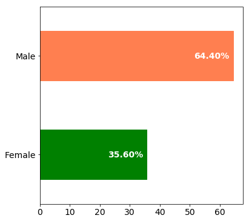
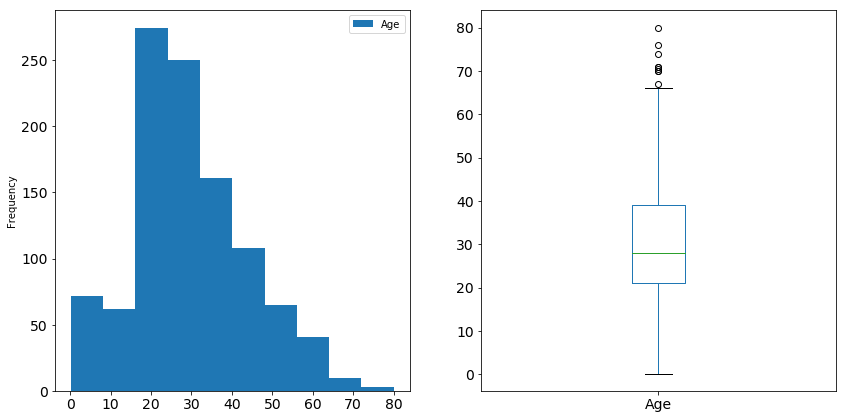
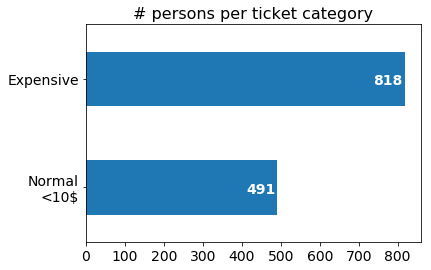
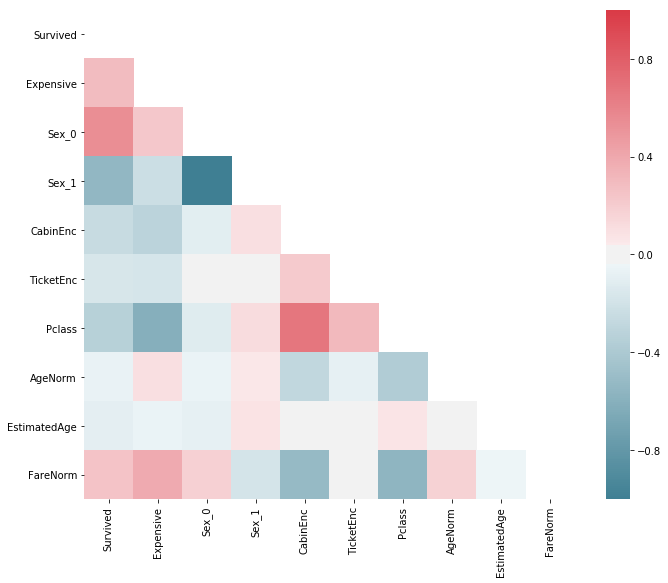
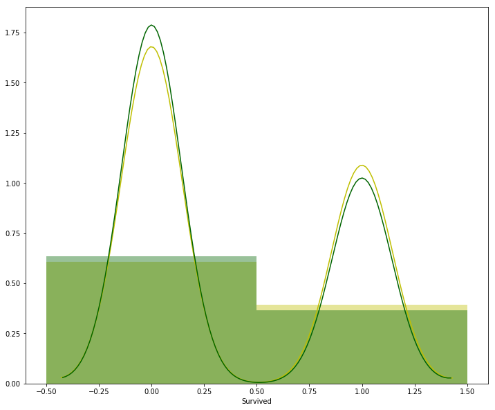

```python
import pandas as pd
import matplotlib.pyplot as plt
import seaborn as sns
import numpy as np
from sklearn import preprocessing
from sklearn.model_selection import train_test_split

%matplotlib inline
```


```python
train_data_orig = pd.read_csv('train.csv')
test_data_orig = pd.read_csv('test.csv')
test_data_orig.loc[:, 'Survived'] = pd.np.nan
merged_data = pd.concat({'train': train_data_orig, 'test': test_data_orig}, axis=0, sort=False)
```


```python
# Show gender distribution

output = merged_data[['PassengerId', 'Sex']].groupby('Sex').count() / len(merged_data['Sex']) * 100
output.columns = ['%']
output.reset_index(inplace=True)

ax = output.plot(kind='barh', figsize=(6, 6), fontsize=14)
ax.set_yticklabels(['Female', 'Male'])
ax.legend().remove()
ax.get_children()[0].set_color('green')
ax.get_children()[1].set_color('coral')

for idx in [0, 1]:
    ax.annotate(
        xy=(output.loc[idx, '%'] - 13, idx-0.03),
        s='{0:.2f}%'.format(output.loc[idx, '%']),
        color='white',
        weight='bold',
        fontsize=14)
```





```python
# Show age distribution
f, (ax1, ax2) = plt.subplots(1, 2, sharey=False, figsize=(14, 7))
merged_data[['Age']].plot(kind='hist', ax=ax1, fontsize=14)
merged_data[['Age']].plot(kind='box', ax=ax2, fontsize=14)
```


    <matplotlib.axes._subplots.AxesSubplot at 0x7feb8b5d24a8>





```python
middle = 10

merged_data['Fare'].replace(pd.np.nan, merged_data['Fare'].mean(), inplace=True)
merged_data['Cabin'].replace(pd.np.nan, 'N/A', inplace=True)

count, bin_edges = np.histogram(merged_data['Fare'], [0, middle, 550])

categories = ['Normal', 'Expensive']

df_fare = pd.DataFrame({'count': count, 'category': categories})

df_fare.set_index('category', inplace=True)

ax = df_fare.plot(kind='barh', fontsize=14)

ax.set_ylabel('')
ax.legend().remove()

ax.set_title('# persons per ticket category', fontsize=16)

ax.set_yticklabels(['Normal\n<%s$' % middle, 'Expensive'])

for idx, cat in enumerate(categories):
    ax.annotate(
        xy=(df_fare.loc[cat, 'count'] - 80, idx - 0.05),
        s=df_fare.loc[cat, 'count'],
        color='white',
        weight='bold',
        fontsize=14)

    
def fare_survival(data, df_fare, middle):
    norm_cond = data['Fare'] < middle
    
    nt_survived = data.loc[norm_cond & (data['Survived'] == 1), ['Survived']].count()
    nt_total = data.loc[norm_cond, 'PassengerId'].count()
    nts = (nt_survived / nt_total).iloc[0] * 100
    print('Normal ticket survival %: {0:.2f}% {1}/{2}'.format(nts, nt_survived[0], nt_total))

    et_survived = data.loc[~norm_cond & (data['Survived'] == 1), ['Survived']].count()
    et_total = data.loc[~norm_cond, 'PassengerId'].count()
    ets = (et_survived / et_total).iloc[0] * 100
    print('Expensive ticket survival %: {0:.2f}% {1}/{2}'.format(ets, et_survived[0], et_total))

    print('Ticket type survival rate: {0:.2f}'.format(ets/nts))


fare_survival(merged_data, df_fare, middle)
```

    Normal ticket survival %: 13.65% 67/491
    Expensive ticket survival %: 33.62% 275/818
    Ticket type survival rate: 2.46





```python
def encode_label(data, label, encoder):
    data[label].replace(pd.np.nan, 'N/A', inplace=True)
    encoding = pd.Series(encoder.transform(data[label]))
    data = pd.concat([data, encoding], axis=1)
    data.rename(columns={0: '{}Enc'.format(label)}, inplace=True)
    return data


def one_hot_encodings(data, field):
    data[field].replace(pd.np.nan, 'N/A', inplace=True)
    
    label_encoder = preprocessing.LabelEncoder()
    label_encodings = label_encoder.fit_transform(data[field])
        
    oh_encoder = preprocessing.OneHotEncoder(sparse=False)
    oh_encodings = oh_encoder.fit_transform(label_encodings.reshape(-1, 1))
    oh_encodings_df = pd.DataFrame(
        oh_encodings,
        columns=['{}_{}'.format(field, it) for it in range(0, oh_encodings.shape[1])],
        index=data.index
    )
    
    return pd.DataFrame({'{}Enc'.format(field): label_encodings}, index=data.index), oh_encodings_df


class Norm():
    
    def __init__(self, data, field):
        self.mean = data[field].mean()
        self.std = data[field].std()
        
    def normalize(self, data, field):
        return data[field] - self.mean / self.std


age_norm = Norm(merged_data, 'Age')
fare_norm = Norm(merged_data, 'Fare')

encoders = dict(
    cabin_encoder=preprocessing.LabelEncoder(),
    embarked_encoder=preprocessing.LabelEncoder(),
    ticket_encoder=preprocessing.LabelEncoder()
)

# encoders['cabin_encoder'].fit(merged_data['Cabin'])
# encoders['embarked_encoder'].fit(merged_data['Embarked'])
# encoders['ticket_encoder'].fit(merged_data['Ticket'])


def preprocess(data_orig):
    # Encode gender
    # male=-1, female=1
    data = data_orig.copy(deep=True)
    
    data['Sex'].replace(pd.np.nan, 'N/A', inplace=True)
    data['Cabin'].replace(pd.np.nan, 'N/A', inplace=True)
    data['Embarked'].replace(pd.np.nan, 'N/A', inplace=True)
    data['Ticket'].replace(pd.np.nan, 'N/A', inplace=True)
    
    # Encode Cabin
    cabin_label_encodings, cabin_oh_encodings = one_hot_encodings(data, 'Cabin')
    data = pd.concat([data, cabin_label_encodings], axis=1)
    data = pd.concat([data, cabin_oh_encodings], axis=1)
        
    # Encode Embarked
    embarked_label_encodings, embarked_oh_encodings = one_hot_encodings(data, 'Embarked')
    data = pd.concat([data, embarked_label_encodings], axis=1)
    data = pd.concat([data, embarked_oh_encodings], axis=1)

    
    # Encode Sex
    sex_label_encodings, sex_oh_encodings = one_hot_encodings(data, 'Sex')
    data = pd.concat([data, sex_label_encodings], axis=1)
    data = pd.concat([data, sex_oh_encodings], axis=1)


    # Encode Ticket
    ticket_label_encodings, ticket_oh_encodings = one_hot_encodings(data, 'Ticket')
    data = pd.concat([data, ticket_label_encodings], axis=1)
    data = pd.concat([data, ticket_oh_encodings], axis=1)
    
    # Replace missing age
    age_mean = np.floor(data[['Age']].mean()) + 0.5
    data['Age'] = data.Age.apply(lambda x: x if not pd.isnull(x) else age_mean.iloc[0])
    
    # Replace missing fare
    fare_mean = (data[['Fare']].mean())
    data['Fare'] = data.Fare.apply(lambda x: x if not pd.isnull(x) else fare_mean.iloc[0])

    
    # Estimated Age
    data.loc[:, 'EstimatedAge'] = 0
    data.loc[(data_orig['Age'] > 1) & ((data_orig['Age'] / 0.5) % 2 > 0), 'EstimatedAge'] = 1
    
    # # Encode Cabin
    # data = encode_label(data, 'Cabin', encoders['cabin_encoder'])
    
    # Add expensive indicator
    data.loc[:, 'Expensive'] = 0
    data.loc[(data['Fare'] >= middle), 'Expensive'] = 1
    
    data['AgeNorm'] = age_norm.normalize(data, 'Age')
    data['FareNorm'] = fare_norm.normalize(data, 'Fare')

    data = pd.concat([data, pd.get_dummies(data['Pclass'])], axis=1)
    data.rename(columns={1: "Pclass1", 2: "Pclass2", 3: "Pclass3"}, inplace=True)
    return data

improved_merged_data = preprocess(merged_data)

train_data = improved_merged_data.loc['train', :]
test_data = improved_merged_data.loc['test', :]

X, y = train_data.drop(columns=['Survived']), train_data[['Survived']]

x_train, x_val, y_train, y_val = train_test_split(X, y, test_size=0.3, random_state=13)

corr = improved_merged_data[
    ['Survived', 'Expensive', 'Sex_0', 'Sex_1', 'CabinEnc', 'TicketEnc', 'Pclass', 'AgeNorm', 'EstimatedAge', 'FareNorm']
].corr()
mask = np.zeros_like(corr, dtype=np.bool)
mask[np.triu_indices_from(mask)] = True

cmap = sns.diverging_palette(220, 10, as_cmap=True)

f, ax = plt.subplots(figsize=(11, 9))

sns.heatmap(corr, cmap=cmap, mask=mask, ax=ax);

# gender_survival = train_data_orig[['Sex', 'Survived']].groupby('Sex').count()
# (gender_survival / train_data_orig[['Sex']].shape[0]).plot(kind='bar')
```





```python
print(merged_data.describe())
```

           PassengerId       Pclass          Age        SibSp        Parch  \
    count  1309.000000  1309.000000  1046.000000  1309.000000  1309.000000   
    mean    655.000000     2.294882    29.881138     0.498854     0.385027   
    std     378.020061     0.837836    14.413493     1.041658     0.865560   
    min       1.000000     1.000000     0.170000     0.000000     0.000000   
    25%     328.000000     2.000000    21.000000     0.000000     0.000000   
    50%     655.000000     3.000000    28.000000     0.000000     0.000000   
    75%     982.000000     3.000000    39.000000     1.000000     0.000000   
    max    1309.000000     3.000000    80.000000     8.000000     9.000000   
    
                  Fare    Survived  
    count  1309.000000  891.000000  
    mean     33.295479    0.383838  
    std      51.738879    0.486592  
    min       0.000000    0.000000  
    25%       7.895800    0.000000  
    50%      14.454200    0.000000  
    75%      31.275000    1.000000  
    max     512.329200    1.000000  


```python
merged_data.dtypes
```


    PassengerId      int64
    Pclass           int64
    Name            object
    Sex             object
    Age            float64
    SibSp            int64
    Parch            int64
    Ticket          object
    Fare           float64
    Cabin           object
    Embarked        object
    Survived       float64
    dtype: object


```python
print(merged_data.head())
```

            PassengerId  Pclass                                          Name  \
    test 0          892       3                              Kelly, Mr. James   
         1          893       3              Wilkes, Mrs. James (Ellen Needs)   
         2          894       2                     Myles, Mr. Thomas Francis   
         3          895       3                              Wirz, Mr. Albert   
         4          896       3  Hirvonen, Mrs. Alexander (Helga E Lindqvist)   
    
               Sex   Age  SibSp  Parch   Ticket     Fare Cabin Embarked  Survived  
    test 0    male  34.5      0      0   330911   7.8292   N/A        Q       NaN  
         1  female  47.0      1      0   363272   7.0000   N/A        S       NaN  
         2    male  62.0      0      0   240276   9.6875   N/A        Q       NaN  
         3    male  27.0      0      0   315154   8.6625   N/A        S       NaN  
         4  female  22.0      1      1  3101298  12.2875   N/A        S       NaN  


```python
import numpy as np
from sklearn import svm
from sklearn.model_selection import GridSearchCV
from sklearn.pipeline import Pipeline
from sklearn.preprocessing import PolynomialFeatures
from sklearn.preprocessing import StandardScaler
from sklearn.linear_model import LinearRegression

columns = [
    # 'TicketEnc',
    # 'EmbarkedEnc',
    # 'Parch',
    'Pclass',
    # 'SibSp',
    'AgeNorm',
    # 'EstimatedAge',
    # 'CabinEnc',
    # 'Fare',
    'FareNorm',
    'SexEnc',
    'Expensive'
]

Input=[
    ('scale', StandardScaler()),
    ('polynomial', PolynomialFeatures(degree=8, include_bias=False)),
    # ('model', svm.SVC(kernel='linear', C=1, class_weight={0: 0.4, 1: 0.6}, random_state=13))
    ('model', svm.SVC(kernel='linear', degree=8, C=1, random_state=13))
]

pipe=Pipeline(Input)

# condition = (x_train['Sex'] == 'female')
# pipe.fit(x_train.loc[condition, columns], y_train.loc[condition, 'Survived'])
pipe.fit(x_train.loc[:, columns], y_train.loc[:, 'Survived'])
```


    Pipeline(memory=None,
         steps=[('scale', StandardScaler(copy=True, with_mean=True, with_std=True)), ('polynomial', PolynomialFeatures(degree=8, include_bias=False, interaction_only=False)), ('model', SVC(C=1, cache_size=200, class_weight=None, coef0=0.0,
      decision_function_shape='ovr', degree=8, gamma='auto', kernel='linear',
      max_iter=-1, probability=False, random_state=13, shrinking=True,
      tol=0.001, verbose=False))])


```python
from sklearn.model_selection import cross_val_score

predicted = pipe.predict(x_val[columns])
print('Validation accuracy:')
print(pipe.score(x_val[columns], y_val['Survived']))

condition = (x_val['Sex'] == 'male')
print('Validation Male accuracy:')
print(pipe.score(x_val.loc[condition, columns], y_val.loc[condition, 'Survived']))

condition = (x_val['Sex'] == 'female')
print('Validation Female accuracy:')
print(pipe.score(x_val.loc[condition, columns], y_val.loc[condition, 'Survived']))
```

    Validation accuracy:
    0.8134328358208955
    Validation Male accuracy:
    0.8433734939759037
    Validation Female accuracy:
    0.7647058823529411


```python
# Cross validation

scores = cross_val_score(pipe, train_data[columns], train_data['Survived'], cv=4)
print(scores.min())
```

    0.7276785714285714


```python
predicted = pipe.predict(test_data[columns])
to_save = pd.concat([test_data.drop(columns=['Survived']), pd.Series(predicted)], axis=1).rename(columns={0: 'Survived'})
print(to_save[['PassengerId', 'Survived']])
to_save[['PassengerId', 'Survived']].to_csv('svc-submission.csv', header=True, index=False)
```

         PassengerId  Survived
    0            892       0.0
    1            893       0.0
    2            894       0.0
    3            895       0.0
    4            896       1.0
    5            897       0.0
    6            898       1.0
    7            899       0.0
    8            900       1.0
    9            901       0.0
    10           902       0.0
    11           903       1.0
    12           904       1.0
    13           905       0.0
    14           906       1.0
    15           907       1.0
    16           908       0.0
    17           909       0.0
    18           910       1.0
    19           911       0.0
    20           912       0.0
    21           913       0.0
    22           914       1.0
    23           915       0.0
    24           916       1.0
    25           917       0.0
    26           918       1.0
    27           919       0.0
    28           920       0.0
    29           921       0.0
    ..           ...       ...
    388         1280       0.0
    389         1281       1.0
    390         1282       0.0
    391         1283       0.0
    392         1284       0.0
    393         1285       0.0
    394         1286       0.0
    395         1287       1.0
    396         1288       0.0
    397         1289       1.0
    398         1290       0.0
    399         1291       0.0
    400         1292       1.0
    401         1293       0.0
    402         1294       1.0
    403         1295       0.0
    404         1296       1.0
    405         1297       0.0
    406         1298       0.0
    407         1299       1.0
    408         1300       1.0
    409         1301       1.0
    410         1302       1.0
    411         1303       1.0
    412         1304       1.0
    413         1305       0.0
    414         1306       1.0
    415         1307       0.0
    416         1308       0.0
    417         1309       0.0
    
    [418 rows x 2 columns]


```python
width = 12
height = 10
plt.figure(figsize=(width, height))

Yhat = pipe.predict(x_train[columns])

bins = [-.5, .5, 1.5]
ax1 = sns.distplot(y_train['Survived'], bins=bins, kde=True, hist=True, color="y", label="Actual Value")
sns.distplot(Yhat, bins=bins, kde=True, hist=True, color="darkgreen", label="Fitted Values", ax=ax1)
```

    /opt/conda/lib/python3.6/site-packages/matplotlib/axes/_axes.py:6462: UserWarning: The 'normed' kwarg is deprecated, and has been replaced by the 'density' kwarg.
      warnings.warn("The 'normed' kwarg is deprecated, and has been "
    /opt/conda/lib/python3.6/site-packages/matplotlib/axes/_axes.py:6462: UserWarning: The 'normed' kwarg is deprecated, and has been replaced by the 'density' kwarg.
      warnings.warn("The 'normed' kwarg is deprecated, and has been "


    <matplotlib.axes._subplots.AxesSubplot at 0x7feb8a85c4e0>





```python
from keras.models import Model
from keras.layers import Input, Dense, Dropout
from keras.utils import to_categorical
from keras import regularizers

columns = [
    'SibSp',
    'Parch',
    # 'EmbarkedEnc',
    # 'Fare',
    # 'CabinEnc',
    'AgeNorm',
    'FareNorm',
    'EstimatedAge',
    'Pclass',
    'Sex_0',
    'Sex_1',
    # 'TicketEnc',
    'Expensive',
] + [
    it for it in improved_merged_data.columns if 'Cabin_' in it
] + [
    it for it in improved_merged_data.columns if 'Ticket_' in it
]
```

    /opt/conda/lib/python3.6/site-packages/h5py/__init__.py:36: FutureWarning: Conversion of the second argument of issubdtype from `float` to `np.floating` is deprecated. In future, it will be treated as `np.float64 == np.dtype(float).type`.
      from ._conv import register_converters as _register_converters
    Using TensorFlow backend.


```python
to_train = x_train[columns]
to_validate = x_val[columns]

lin = Input(shape=(len(columns),))
l1 = Dense(32, activation='relu', kernel_initializer='he_normal')(lin)
l1_drop = Dropout(0.5)(l1)
# l2 = Dense(16, activation='relu', kernel_initializer='he_normal', kernel_regularizer=regularizers.l2(0.03))(l1)
lout = Dense(2, activation='softmax')(l1)

model = Model(inputs=lin, outputs=lout)

model.compile(
    optimizer='adagrad',
    loss='categorical_crossentropy',
    metrics=['categorical_accuracy'])

model.fit(
    to_train, to_categorical(y_train['Survived'], 2),
    validation_data=(to_validate, to_categorical(y_val['Survived'], 2)),
    epochs=100,
    steps_per_epoch=10, validation_steps=1,
    verbose=1,
    shuffle=True)

print(model.evaluate(to_validate, to_categorical(y_val['Survived'], 2)))
```

    Train on 623 samples, validate on 268 samples
    Epoch 1/100
    10/10 [==============================] - 0s 13ms/step - loss: 0.7910 - categorical_accuracy: 0.6822 - val_loss: 0.5507 - val_categorical_accuracy: 0.7537
    Epoch 2/100
    10/10 [==============================] - 0s 5ms/step - loss: 0.4478 - categorical_accuracy: 0.8258 - val_loss: 0.4810 - val_categorical_accuracy: 0.8060
    Epoch 3/100
    10/10 [==============================] - 0s 5ms/step - loss: 0.3881 - categorical_accuracy: 0.8695 - val_loss: 0.4632 - val_categorical_accuracy: 0.8284
    Epoch 4/100
    10/10 [==============================] - 0s 5ms/step - loss: 0.3320 - categorical_accuracy: 0.9154 - val_loss: 0.4491 - val_categorical_accuracy: 0.8396
    Epoch 5/100
    10/10 [==============================] - 0s 5ms/step - loss: 0.2956 - categorical_accuracy: 0.9274 - val_loss: 0.4385 - val_categorical_accuracy: 0.8358
    Epoch 6/100
    10/10 [==============================] - 0s 5ms/step - loss: 0.2659 - categorical_accuracy: 0.9372 - val_loss: 0.4316 - val_categorical_accuracy: 0.8396
    Epoch 7/100
    10/10 [==============================] - 0s 5ms/step - loss: 0.2381 - categorical_accuracy: 0.9494 - val_loss: 0.4238 - val_categorical_accuracy: 0.8433
    Epoch 8/100
    10/10 [==============================] - 0s 5ms/step - loss: 0.2162 - categorical_accuracy: 0.9549 - val_loss: 0.4196 - val_categorical_accuracy: 0.8396
    Epoch 9/100
    10/10 [==============================] - 0s 5ms/step - loss: 0.1988 - categorical_accuracy: 0.9589 - val_loss: 0.4162 - val_categorical_accuracy: 0.8396
    Epoch 10/100
    10/10 [==============================] - 0s 5ms/step - loss: 0.1834 - categorical_accuracy: 0.9607 - val_loss: 0.4144 - val_categorical_accuracy: 0.8321
    Epoch 11/100
    10/10 [==============================] - 0s 5ms/step - loss: 0.1703 - categorical_accuracy: 0.9640 - val_loss: 0.4136 - val_categorical_accuracy: 0.8321
    Epoch 12/100
    10/10 [==============================] - 0s 5ms/step - loss: 0.1610 - categorical_accuracy: 0.9684 - val_loss: 0.4132 - val_categorical_accuracy: 0.8246
    Epoch 13/100
    10/10 [==============================] - 0s 5ms/step - loss: 0.1491 - categorical_accuracy: 0.9756 - val_loss: 0.4111 - val_categorical_accuracy: 0.8321
    Epoch 14/100
    10/10 [==============================] - 0s 6ms/step - loss: 0.1391 - categorical_accuracy: 0.9819 - val_loss: 0.4096 - val_categorical_accuracy: 0.8321
    Epoch 15/100
    10/10 [==============================] - 0s 5ms/step - loss: 0.1304 - categorical_accuracy: 0.9848 - val_loss: 0.4089 - val_categorical_accuracy: 0.8358
    Epoch 16/100
    10/10 [==============================] - 0s 5ms/step - loss: 0.1228 - categorical_accuracy: 0.9856 - val_loss: 0.4087 - val_categorical_accuracy: 0.8321
    Epoch 17/100
    10/10 [==============================] - 0s 5ms/step - loss: 0.1160 - categorical_accuracy: 0.9881 - val_loss: 0.4087 - val_categorical_accuracy: 0.8358
    Epoch 18/100
    10/10 [==============================] - 0s 5ms/step - loss: 0.1099 - categorical_accuracy: 0.9904 - val_loss: 0.4089 - val_categorical_accuracy: 0.8358
    Epoch 19/100
    10/10 [==============================] - 0s 5ms/step - loss: 0.1044 - categorical_accuracy: 0.9918 - val_loss: 0.4090 - val_categorical_accuracy: 0.8321
    Epoch 20/100
    10/10 [==============================] - 0s 5ms/step - loss: 0.0994 - categorical_accuracy: 0.9934 - val_loss: 0.4093 - val_categorical_accuracy: 0.8321
    Epoch 21/100
    10/10 [==============================] - 0s 5ms/step - loss: 0.0947 - categorical_accuracy: 0.9950 - val_loss: 0.4093 - val_categorical_accuracy: 0.8321
    Epoch 22/100
    10/10 [==============================] - 0s 5ms/step - loss: 0.0904 - categorical_accuracy: 0.9952 - val_loss: 0.4100 - val_categorical_accuracy: 0.8358
    Epoch 23/100
    10/10 [==============================] - 0s 5ms/step - loss: 0.0866 - categorical_accuracy: 0.9952 - val_loss: 0.4108 - val_categorical_accuracy: 0.8284
    Epoch 24/100
    10/10 [==============================] - 0s 5ms/step - loss: 0.0831 - categorical_accuracy: 0.9952 - val_loss: 0.4115 - val_categorical_accuracy: 0.8246
    Epoch 25/100
    10/10 [==============================] - 0s 5ms/step - loss: 0.0798 - categorical_accuracy: 0.9952 - val_loss: 0.4117 - val_categorical_accuracy: 0.8246
    Epoch 26/100
    10/10 [==============================] - 0s 5ms/step - loss: 0.0768 - categorical_accuracy: 0.9952 - val_loss: 0.4121 - val_categorical_accuracy: 0.8284
    Epoch 27/100
    10/10 [==============================] - 0s 5ms/step - loss: 0.0740 - categorical_accuracy: 0.9952 - val_loss: 0.4129 - val_categorical_accuracy: 0.8246
    Epoch 28/100
    10/10 [==============================] - 0s 5ms/step - loss: 0.0715 - categorical_accuracy: 0.9952 - val_loss: 0.4136 - val_categorical_accuracy: 0.8246
    Epoch 29/100
    10/10 [==============================] - 0s 5ms/step - loss: 0.0691 - categorical_accuracy: 0.9952 - val_loss: 0.4144 - val_categorical_accuracy: 0.8246
    Epoch 30/100
    10/10 [==============================] - 0s 5ms/step - loss: 0.0669 - categorical_accuracy: 0.9952 - val_loss: 0.4151 - val_categorical_accuracy: 0.8246
    Epoch 31/100
    10/10 [==============================] - 0s 6ms/step - loss: 0.0648 - categorical_accuracy: 0.9952 - val_loss: 0.4159 - val_categorical_accuracy: 0.8246
    Epoch 32/100
    10/10 [==============================] - 0s 5ms/step - loss: 0.0629 - categorical_accuracy: 0.9952 - val_loss: 0.4168 - val_categorical_accuracy: 0.8246
    Epoch 33/100
    10/10 [==============================] - 0s 5ms/step - loss: 0.0610 - categorical_accuracy: 0.9952 - val_loss: 0.4177 - val_categorical_accuracy: 0.8246
    Epoch 34/100
    10/10 [==============================] - 0s 5ms/step - loss: 0.0593 - categorical_accuracy: 0.9952 - val_loss: 0.4185 - val_categorical_accuracy: 0.8246
    Epoch 35/100
    10/10 [==============================] - 0s 5ms/step - loss: 0.0577 - categorical_accuracy: 0.9952 - val_loss: 0.4194 - val_categorical_accuracy: 0.8246
    Epoch 36/100
    10/10 [==============================] - 0s 5ms/step - loss: 0.0562 - categorical_accuracy: 0.9952 - val_loss: 0.4203 - val_categorical_accuracy: 0.8246
    Epoch 37/100
    10/10 [==============================] - 0s 5ms/step - loss: 0.0547 - categorical_accuracy: 0.9952 - val_loss: 0.4211 - val_categorical_accuracy: 0.8246
    Epoch 38/100
    10/10 [==============================] - 0s 5ms/step - loss: 0.0534 - categorical_accuracy: 0.9952 - val_loss: 0.4221 - val_categorical_accuracy: 0.8246
    Epoch 39/100
    10/10 [==============================] - 0s 5ms/step - loss: 0.0521 - categorical_accuracy: 0.9952 - val_loss: 0.4231 - val_categorical_accuracy: 0.8246
    Epoch 40/100
    10/10 [==============================] - 0s 5ms/step - loss: 0.0509 - categorical_accuracy: 0.9952 - val_loss: 0.4239 - val_categorical_accuracy: 0.8246
    Epoch 41/100
    10/10 [==============================] - 0s 5ms/step - loss: 0.0497 - categorical_accuracy: 0.9952 - val_loss: 0.4248 - val_categorical_accuracy: 0.8246
    Epoch 42/100
    10/10 [==============================] - 0s 5ms/step - loss: 0.0486 - categorical_accuracy: 0.9952 - val_loss: 0.4258 - val_categorical_accuracy: 0.8246
    Epoch 43/100
    10/10 [==============================] - 0s 5ms/step - loss: 0.0476 - categorical_accuracy: 0.9952 - val_loss: 0.4266 - val_categorical_accuracy: 0.8246
    Epoch 44/100
    10/10 [==============================] - 0s 5ms/step - loss: 0.0466 - categorical_accuracy: 0.9952 - val_loss: 0.4274 - val_categorical_accuracy: 0.8246
    Epoch 45/100
    10/10 [==============================] - 0s 5ms/step - loss: 0.0456 - categorical_accuracy: 0.9952 - val_loss: 0.4283 - val_categorical_accuracy: 0.8246
    Epoch 46/100
    10/10 [==============================] - 0s 5ms/step - loss: 0.0447 - categorical_accuracy: 0.9952 - val_loss: 0.4292 - val_categorical_accuracy: 0.8284
    Epoch 47/100
    10/10 [==============================] - 0s 5ms/step - loss: 0.0439 - categorical_accuracy: 0.9952 - val_loss: 0.4300 - val_categorical_accuracy: 0.8284
    Epoch 48/100
    10/10 [==============================] - 0s 5ms/step - loss: 0.0430 - categorical_accuracy: 0.9952 - val_loss: 0.4308 - val_categorical_accuracy: 0.8284
    Epoch 49/100
    10/10 [==============================] - 0s 5ms/step - loss: 0.0423 - categorical_accuracy: 0.9952 - val_loss: 0.4317 - val_categorical_accuracy: 0.8284
    Epoch 50/100
    10/10 [==============================] - 0s 5ms/step - loss: 0.0415 - categorical_accuracy: 0.9952 - val_loss: 0.4326 - val_categorical_accuracy: 0.8284
    Epoch 51/100
    10/10 [==============================] - 0s 5ms/step - loss: 0.0408 - categorical_accuracy: 0.9952 - val_loss: 0.4335 - val_categorical_accuracy: 0.8284
    Epoch 52/100
    10/10 [==============================] - 0s 5ms/step - loss: 0.0401 - categorical_accuracy: 0.9952 - val_loss: 0.4344 - val_categorical_accuracy: 0.8284
    Epoch 53/100
    10/10 [==============================] - 0s 5ms/step - loss: 0.0394 - categorical_accuracy: 0.9952 - val_loss: 0.4352 - val_categorical_accuracy: 0.8284
    Epoch 54/100
    10/10 [==============================] - 0s 5ms/step - loss: 0.0388 - categorical_accuracy: 0.9952 - val_loss: 0.4361 - val_categorical_accuracy: 0.8284
    Epoch 55/100
    10/10 [==============================] - 0s 5ms/step - loss: 0.0382 - categorical_accuracy: 0.9952 - val_loss: 0.4371 - val_categorical_accuracy: 0.8284
    Epoch 56/100
    10/10 [==============================] - 0s 5ms/step - loss: 0.0376 - categorical_accuracy: 0.9952 - val_loss: 0.4380 - val_categorical_accuracy: 0.8284
    Epoch 57/100
    10/10 [==============================] - 0s 5ms/step - loss: 0.0370 - categorical_accuracy: 0.9952 - val_loss: 0.4388 - val_categorical_accuracy: 0.8284
    Epoch 58/100
    10/10 [==============================] - 0s 5ms/step - loss: 0.0365 - categorical_accuracy: 0.9952 - val_loss: 0.4397 - val_categorical_accuracy: 0.8284
    Epoch 59/100
    10/10 [==============================] - 0s 5ms/step - loss: 0.0360 - categorical_accuracy: 0.9952 - val_loss: 0.4406 - val_categorical_accuracy: 0.8284
    Epoch 60/100
    10/10 [==============================] - 0s 5ms/step - loss: 0.0355 - categorical_accuracy: 0.9952 - val_loss: 0.4415 - val_categorical_accuracy: 0.8284
    Epoch 61/100
    10/10 [==============================] - 0s 5ms/step - loss: 0.0350 - categorical_accuracy: 0.9952 - val_loss: 0.4423 - val_categorical_accuracy: 0.8284
    Epoch 62/100
    10/10 [==============================] - 0s 5ms/step - loss: 0.0345 - categorical_accuracy: 0.9952 - val_loss: 0.4432 - val_categorical_accuracy: 0.8284
    Epoch 63/100
    10/10 [==============================] - 0s 5ms/step - loss: 0.0340 - categorical_accuracy: 0.9952 - val_loss: 0.4440 - val_categorical_accuracy: 0.8284
    Epoch 64/100
    10/10 [==============================] - 0s 4ms/step - loss: 0.0336 - categorical_accuracy: 0.9952 - val_loss: 0.4449 - val_categorical_accuracy: 0.8284
    Epoch 65/100
    10/10 [==============================] - 0s 5ms/step - loss: 0.0332 - categorical_accuracy: 0.9952 - val_loss: 0.4457 - val_categorical_accuracy: 0.8284
    Epoch 66/100
    10/10 [==============================] - 0s 5ms/step - loss: 0.0328 - categorical_accuracy: 0.9952 - val_loss: 0.4466 - val_categorical_accuracy: 0.8284
    Epoch 67/100
    10/10 [==============================] - 0s 5ms/step - loss: 0.0324 - categorical_accuracy: 0.9952 - val_loss: 0.4475 - val_categorical_accuracy: 0.8284
    Epoch 68/100
    10/10 [==============================] - 0s 5ms/step - loss: 0.0320 - categorical_accuracy: 0.9952 - val_loss: 0.4484 - val_categorical_accuracy: 0.8284
    Epoch 69/100
    10/10 [==============================] - 0s 5ms/step - loss: 0.0316 - categorical_accuracy: 0.9952 - val_loss: 0.4492 - val_categorical_accuracy: 0.8284
    Epoch 70/100
    10/10 [==============================] - 0s 5ms/step - loss: 0.0312 - categorical_accuracy: 0.9952 - val_loss: 0.4501 - val_categorical_accuracy: 0.8284
    Epoch 71/100
    10/10 [==============================] - 0s 5ms/step - loss: 0.0309 - categorical_accuracy: 0.9952 - val_loss: 0.4510 - val_categorical_accuracy: 0.8284
    Epoch 72/100
    10/10 [==============================] - 0s 5ms/step - loss: 0.0305 - categorical_accuracy: 0.9952 - val_loss: 0.4519 - val_categorical_accuracy: 0.8284
    Epoch 73/100
    10/10 [==============================] - 0s 5ms/step - loss: 0.0302 - categorical_accuracy: 0.9952 - val_loss: 0.4527 - val_categorical_accuracy: 0.8321
    Epoch 74/100
    10/10 [==============================] - 0s 5ms/step - loss: 0.0299 - categorical_accuracy: 0.9952 - val_loss: 0.4535 - val_categorical_accuracy: 0.8321
    Epoch 75/100
    10/10 [==============================] - 0s 4ms/step - loss: 0.0296 - categorical_accuracy: 0.9952 - val_loss: 0.4544 - val_categorical_accuracy: 0.8321
    Epoch 76/100
    10/10 [==============================] - 0s 5ms/step - loss: 0.0293 - categorical_accuracy: 0.9952 - val_loss: 0.4552 - val_categorical_accuracy: 0.8321
    Epoch 77/100
    10/10 [==============================] - 0s 5ms/step - loss: 0.0290 - categorical_accuracy: 0.9952 - val_loss: 0.4561 - val_categorical_accuracy: 0.8321
    Epoch 78/100
    10/10 [==============================] - 0s 5ms/step - loss: 0.0287 - categorical_accuracy: 0.9952 - val_loss: 0.4569 - val_categorical_accuracy: 0.8321
    Epoch 79/100
    10/10 [==============================] - 0s 5ms/step - loss: 0.0284 - categorical_accuracy: 0.9952 - val_loss: 0.4579 - val_categorical_accuracy: 0.8321
    Epoch 80/100
    10/10 [==============================] - 0s 5ms/step - loss: 0.0281 - categorical_accuracy: 0.9952 - val_loss: 0.4586 - val_categorical_accuracy: 0.8321
    Epoch 81/100
    10/10 [==============================] - 0s 4ms/step - loss: 0.0278 - categorical_accuracy: 0.9952 - val_loss: 0.4594 - val_categorical_accuracy: 0.8321
    Epoch 82/100
    10/10 [==============================] - 0s 5ms/step - loss: 0.0276 - categorical_accuracy: 0.9952 - val_loss: 0.4603 - val_categorical_accuracy: 0.8321
    Epoch 83/100
    10/10 [==============================] - 0s 5ms/step - loss: 0.0273 - categorical_accuracy: 0.9952 - val_loss: 0.4612 - val_categorical_accuracy: 0.8321
    Epoch 84/100
    10/10 [==============================] - 0s 5ms/step - loss: 0.0271 - categorical_accuracy: 0.9952 - val_loss: 0.4620 - val_categorical_accuracy: 0.8321
    Epoch 85/100
    10/10 [==============================] - 0s 4ms/step - loss: 0.0268 - categorical_accuracy: 0.9952 - val_loss: 0.4628 - val_categorical_accuracy: 0.8321
    Epoch 86/100
    10/10 [==============================] - 0s 5ms/step - loss: 0.0266 - categorical_accuracy: 0.9952 - val_loss: 0.4636 - val_categorical_accuracy: 0.8321
    Epoch 87/100
    10/10 [==============================] - 0s 5ms/step - loss: 0.0264 - categorical_accuracy: 0.9952 - val_loss: 0.4644 - val_categorical_accuracy: 0.8321
    Epoch 88/100
    10/10 [==============================] - 0s 5ms/step - loss: 0.0262 - categorical_accuracy: 0.9952 - val_loss: 0.4653 - val_categorical_accuracy: 0.8321
    Epoch 89/100
    10/10 [==============================] - 0s 4ms/step - loss: 0.0259 - categorical_accuracy: 0.9952 - val_loss: 0.4661 - val_categorical_accuracy: 0.8321
    Epoch 90/100
    10/10 [==============================] - 0s 5ms/step - loss: 0.0257 - categorical_accuracy: 0.9952 - val_loss: 0.4669 - val_categorical_accuracy: 0.8321
    Epoch 91/100
    10/10 [==============================] - 0s 5ms/step - loss: 0.0255 - categorical_accuracy: 0.9952 - val_loss: 0.4677 - val_categorical_accuracy: 0.8321
    Epoch 92/100
    10/10 [==============================] - 0s 5ms/step - loss: 0.0253 - categorical_accuracy: 0.9952 - val_loss: 0.4686 - val_categorical_accuracy: 0.8321
    Epoch 93/100
    10/10 [==============================] - 0s 4ms/step - loss: 0.0251 - categorical_accuracy: 0.9952 - val_loss: 0.4693 - val_categorical_accuracy: 0.8321
    Epoch 94/100
    10/10 [==============================] - 0s 5ms/step - loss: 0.0249 - categorical_accuracy: 0.9952 - val_loss: 0.4701 - val_categorical_accuracy: 0.8321
    Epoch 95/100
    10/10 [==============================] - 0s 5ms/step - loss: 0.0247 - categorical_accuracy: 0.9952 - val_loss: 0.4710 - val_categorical_accuracy: 0.8321
    Epoch 96/100
    10/10 [==============================] - 0s 5ms/step - loss: 0.0246 - categorical_accuracy: 0.9952 - val_loss: 0.4717 - val_categorical_accuracy: 0.8321
    Epoch 97/100
    10/10 [==============================] - 0s 4ms/step - loss: 0.0244 - categorical_accuracy: 0.9952 - val_loss: 0.4725 - val_categorical_accuracy: 0.8321
    Epoch 98/100
    10/10 [==============================] - 0s 5ms/step - loss: 0.0242 - categorical_accuracy: 0.9952 - val_loss: 0.4734 - val_categorical_accuracy: 0.8321
    Epoch 99/100
    10/10 [==============================] - 0s 4ms/step - loss: 0.0240 - categorical_accuracy: 0.9952 - val_loss: 0.4741 - val_categorical_accuracy: 0.8321
    Epoch 100/100
    10/10 [==============================] - 0s 5ms/step - loss: 0.0239 - categorical_accuracy: 0.9952 - val_loss: 0.4750 - val_categorical_accuracy: 0.8321
    268/268 [==============================] - 0s 19us/step
    [0.47499272360730527, 0.8320895531284276]


```python
predicted = model.predict(test_data[columns])
output = []

# [0. 1.] means Survived
for idx, item in enumerate(predicted):
    output.append(int(item[0] < item[1]))

output = pd.Series(output, index=test_data['PassengerId'])
to_save = output.reset_index()
to_save.columns = ['PassengerId', 'Survived']
print(to_save[['PassengerId', 'Survived']])
to_save[['PassengerId', 'Survived']].to_csv('submission.csv', header=True, index=False)
```

         PassengerId  Survived
    0            892         0
    1            893         1
    2            894         0
    3            895         0
    4            896         1
    5            897         0
    6            898         1
    7            899         1
    8            900         1
    9            901         0
    10           902         0
    11           903         0
    12           904         1
    13           905         0
    14           906         1
    15           907         0
    16           908         0
    17           909         0
    18           910         1
    19           911         1
    20           912         0
    21           913         0
    22           914         1
    23           915         0
    24           916         1
    25           917         0
    26           918         1
    27           919         0
    28           920         0
    29           921         0
    ..           ...       ...
    388         1280         0
    389         1281         0
    390         1282         1
    391         1283         1
    392         1284         0
    393         1285         0
    394         1286         0
    395         1287         1
    396         1288         0
    397         1289         1
    398         1290         0
    399         1291         0
    400         1292         1
    401         1293         0
    402         1294         1
    403         1295         0
    404         1296         0
    405         1297         0
    406         1298         0
    407         1299         0
    408         1300         1
    409         1301         1
    410         1302         1
    411         1303         1
    412         1304         1
    413         1305         0
    414         1306         1
    415         1307         0
    416         1308         0
    417         1309         0
    
    [418 rows x 2 columns]


```python
!kaggle competitions submit -c titanic -f submission.csv -m ""
```

    Successfully submitted to Titanic: Machine Learning from Disaster
